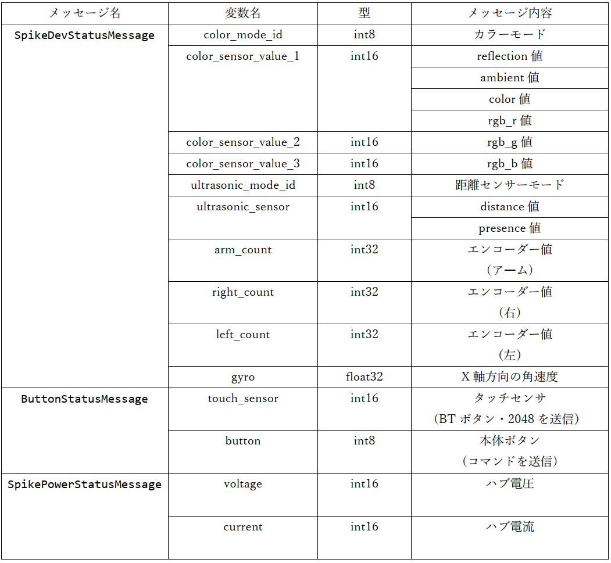
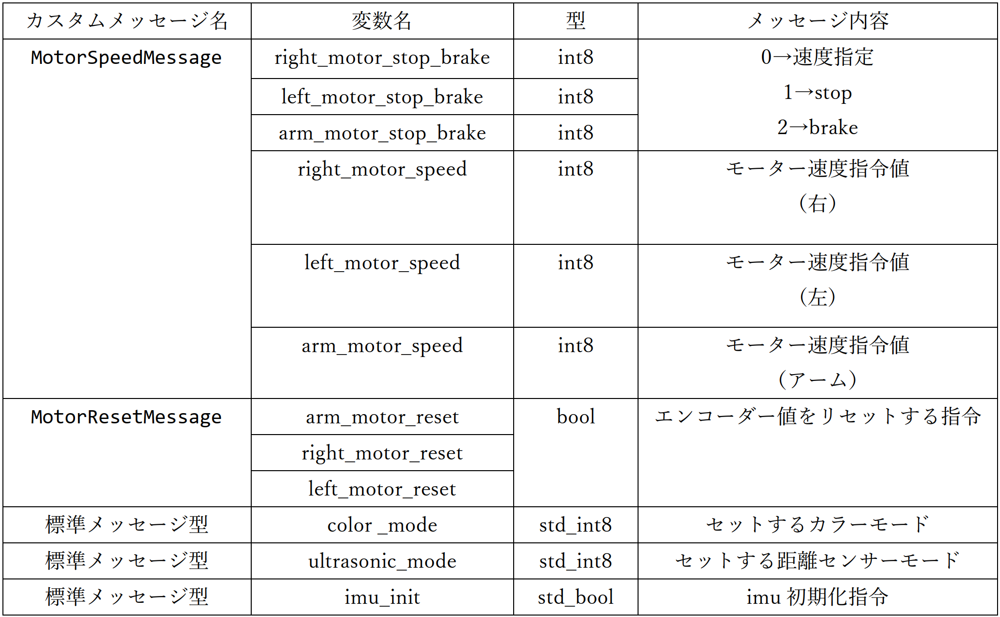

# ROS通信によるETロボコン走行体の制御アプリケーション開発用プラットフォーム
ROSによるETロボコン用走行体の制御アプリケーション，およびアプリケーション開発用ソフトウェアプラットフォーム

# 動作環境
- SPIKE側
    - spike-rt(OS)とmicro-ROS_ASP3を使用
        - この2つはSPIKE上で稼働するmicro-ROS(uROS)プログラム[uros_raspike-rt](./uros_raspike_rt)に変更を加えたい場合に限り，インストールが必要
            - 変更を加える必要が無い場合は[bin](./bin/)フォルダからSPIKEにバイナリを書き込むだけで実行が可能
    - Git Hub
        - [micro-ROS_ASP3](https://github.com/exshonda/micro-ROS_ASP3)
        - [spike-rt](https://github.com/spike-rt/spike-rt)
- rasberryPi側
    - rasberryPi OS(64bit)
    - ROS2 Humble

- 動作確認済みのバージョン
    - micro-ROS_ASP3
        - コミット識別番号：3a306729a797d0f4976daab50c5698acffe38a12
        - [Git Hub](https://github.com/exshonda/micro-ROS_ASP3/tree/3a306729a797d0f4976daab50c5698acffe38a12)
    - spike-rt
        - コミット識別番号：f6724115b0ef8c8367a760eaec2840089e6b4e55
        - [Git Hub](https://github.com/spike-rt/spike-rt/tree/f6724115b0ef8c8367a760eaec2840089e6b4e55)

# 特徴・ファイル構成
## 特徴
- 2種類の方法でアプリを開発できる
    - [app_node.py](./ros2_raspike_rt/ros2_raspike_rt/app_node.py)(ros2_raspike_rt)内の`app_timer()`で，[専用API](./ros2_raspike_rt/API_REFERENCE.md)を使用して開発する方法
    - [linetrace_sample](./linetrace_sample/)のようにROS2タスク内に直接処理を記述する方法
## ファイル構成
- bin
    - [uros_raspike-rt](./uros_raspike_rt)パッケージのバイナリファイル
    - SPIKE-RT上で稼働する，ROS2(rasberryPi)と通信するためのuROSプログラム
    - DFUモードでSPIKEに書き込んで使用する
    - 使用方法は後述

- raspike_uros_msg
    - メッセージ型定義用パッケージ
    - SPIKEとrasberryPiの両方で使用
        - SPIKE：`micro-ROS_ASP3\external\primehub\firmware\mcu_ws`に置く
        - rasberryPi：`<ROS2ワークスペース>\src`に置く

- ros2_raspike_rt(アプリ開発用パッケージ)
    - `ros2_raspike_rt\ros2_raspike_rt\app_node.py`
        - アプリ開発用のファイル
            - Pythonによるアプリ開発が可能
            - appNodeクラス内の`app_timer()`に処理を記述する
                - 周期的に呼ばれる
        - APIは[APIリファレンス](./ros2_raspike_rt/API_REFERENCE.md)を参照
    - `ros2_raspike_rt\ros2_raspike_rt\rpi_ros2_node.py`
        - uROSからのセンサ値の受信・app_node.pyで計算された指令値の送信を行うROS2プログラム
            - app_node.pyからAPIを介して指令値が渡される
            - uros_raspike-rtと通信する
    - `ros2_raspike_rt\ros2_raspike_rt\lib\*.py`
        - APIのライブラリ等    

- linetrace_sample
    - uROS(uros_raspike-rt)と通信して動作するROS2アプリケーションのサンプルパッケージ
        - ROS2のタスク内に直接ライントレースの処理を記入したもの
    - rasberryPi上で実行
    - `<ROS2ワークスペース>\src`に置いてビルド
    - `$ ros2 run linetrace_sample lt_sample_node`で実行

- uros_raspike-rt
    - SPIKE側で動作するuROSパッケージ
    - SPIKEをDFUモードにして書き込む

# 使用方法(uROSプログラムに変更が必要無い場合)
## rasberryPi側の環境構築
### rasberryPi OS (**64bit**)をインストール
- [インストラー](https://www.raspberrypi.com/software/)をインストール
- インストラーからrasberryPi OS(64bit)をインストール
    - ROSを動かすために64bit版をインストールする

### ROS2のインストール
1. アップデート
    ```bash
    $ sudo apt update
    $ sudo apt -y upgrade 
    ```

1. ROS2パッケージをインストールする
    ```bash
    $ wget https://s3.ap-northeast-1.wasabisys.com/download-raw/dpkg/ros2-desktop/debian/bullseye/ros-humble-desktop-0.3.1_arm64.deb
    $ sudo apt install -y ./ros-humble-desktop-0.3.1_arm64.deb
    $ source /opt/ros/humble/setup.bash
    ```

1. ROS環境の自動読み込み設定
    ```bash
    $ echo "source /opt/ros/humble/setup.bash" >> ~/.bashrc
    $ source ~/.bashrc
    ```

1. 動作確認
    ```bash
    $ ros2 launch demo_nodes_cpp talker_listener.launch.py
    ```
    - 下記のように出力されれば成功
    ```bash
    [INFO] [launch]: All log files can be found below /home/hiyama/.ros/log/2023-07-04-14-52-42-067659-raspi-1582
    [INFO] [launch]: Default logging verbosity is set to INFO
    [INFO] [talker-1]: process started with pid [1583]
    [INFO] [listener-2]: process started with pid [1585]
    [talker-1] [INFO] [1688449964.564641073] [talker]: Publishing: 'Hello World: 1'
    [listener-2] [INFO] [1688449964.565626925] [listener]: I heard: [Hello World: 1]
    [talker-1] [INFO] [1688449965.564647258] [talker]: Publishing: 'Hello World: 2'
    [listener-2] [INFO] [1688449965.565234628] [listener]: I heard: [Hello World: 2]
    ...
    ```
1. ROS2用のワークスペースを作成する
    ```bash
    $ mkdir ros2_ws
    $ cd ros2_ws
    $ mkdir src
    ```

1. ROS2パッケージをワークスペースに置く
    - `ros2_ws\src`に以下のファイルを置く
        - raspike_uros_msg
        - ros2_raspike_rt
        - linetrace_sample
            - （※）ros2_raspike_rtとlinetrace_sampleはどちらか片方でも構わない

1. ROS2パッケージをビルドする
    ```bash
    $ colcon build
    $ . install/setup.bash
    ```

### エージェントのビルドと実行（方法1，2のどちらでも可）
#### エージェントのビルドと実行　方法1
1. 参考

- 下記の記事を参考にで`Micro-XRCE-DDS-Agent`をビルドする<BR>
<https://qiita.com/lutecia16v/items/5760551dd3a7a0d3e7d3>

1. `Micro-XRCE-DDS-Agent`のコードをクローン

    ``` bash
    cd ~
    git clone https://github.com/eProsima/Micro-XRCE-DDS-Agent.git
    ```

1. ビルド

    ```bash
    cd Micro-XRCE-DDS-Agent
    mkdir build && cd build
    cmake -DTHIRDPARTY=ON ..
    make
    sudo make install
    sudo ldconfig /usr/local/lib/
    ```

1. 実行

- `verbose_level`を6に設定して、メッセージの受信を表示するようにする
    - 2つ目のコマンドのエージェント実行は`sudo`が必要な場合がある

    ```bash
    source /opt/ros/humble/setup.bash
    MicroXRCEAgent serial --dev [device] -v 6
    ```

#### エージェントのビルドと実行　方法2
1. エージェントのビルド
    ```bash
    cd uros_ws    
    ros2 run micro_ros_setup create_agent_ws.sh
    colcon build
    source install/local_setup.bash
    ```

1. エージェントの実行

    ```bash
    ros2 run micro_ros_agent micro_ros_agent serial --dev [device]
    ```    

## SPIKE側の環境構築
1. SPIKEをDFUモードにする
    - SPIKEのbluetooth(BT)ボタンを押したままPCをSPIKEをケーブルで接続し，BTボタンを離さずにSPIKEの電源を入れる
    - BTボタンが，「ピンク色に点灯」→「虹色に点滅」になったら成功

1. binフォルダからasp.dfuを書き込む
    - (注)pyusbが必要
    ```bash
    $ cd bin
    $ sudo python3 ./pydfu.py -u asp.dfu --vid 0x0694 --pid 0x0008
    ```

## ROS2プログラムの実行
- rasberryPiでagentの実行とは別のターミナルを起動して実行する．
- コマンドのフォーマットは次の通り
    ```bash
    $ ros2 run [パッケージ名] [ノード名]
    ```
### ros2_raspike_rtでアプリを開発・実行する場合
1. ros2_raspike_rt/ros2_raspike_rt/app_node.pyに処理を記述
    - `app_timer()`はデフォルトでは10ms周期で呼び出される
    - [APIリファレンス](./ros2_raspike_rt/API_REFERENCE.md)

1. 下記のコマンドで実行
    ```bash
    $ ros2 run ros2_raspike_rt rpi_ros2_node
    ```

### linetrace_sampleを実行する場合
- 下記のコマンドで実行
    ```bash
    $ ros2 run linetrace_sample lt_sample_node
    ```

# SPIKE側のuROSプログラムを編集したい場合の環境構築方法
- uros_raspike-rtの使用方法
## rasberryPi側の環境構築
- [uROSプログラムに変更が必要無い場合](#使用方法urosプログラムに変更が必要無い場合)と同じ
## SPIKE側の環境構築
1. ワークスペースを作成する
    ```bash
    $ mkdir asp_uros_ws
    $ cd asp_uros_ws
    ```

1. spike-rtとmicro-ROS_ASP3をクローン
    - [動作確認済のバージョン](#動作環境)
    ```bash
    $ git clone https://github.com/exshonda/micro-ROS_ASP3.git
    $ git clone https://github.com/spike-rt/spike-rt.git
    ```

1. spike-rtとmicro-ROS_ASP3をセットアップ
    - 参考
        - [micro-ROS_ASP3](https://github.com/exshonda/micro-ROS_ASP3)
            - `Makefile.config`のターゲットボードはPrime Hubを選択する
        - [spike-rt](https://github.com/spike-rt/spike-rt)

1. micro-ROS_ASP3にカスタムメッセージ定義パッケージを追加
    - `micro-ROS_ASP3\external\primehub\firmware\mcu_ws`にraspike_uros_msgを置く
    - `micro-ROS_ASP3\micro_ros_asp\micro_ros_asp.mk`に下記を追加
    ```
    INCLUDES += -I$(MIROROS_ASP3_TOP_DIR)/$(MICROROS_INC)/raspike_uros_msg
    ```
    - libmicroros.a のビルドを実行
    ```bash
    $ cd micro-ROS_ASP3\external
    $ make build_firmware
    ```

1. uROSパッケージを追加・SPIKEへの書き込み
    - `micro-ROS_ASP3\spike-rt`にuros_raspike-rtを置く
    - 下記のどちらかのコマンドでビルド・書き込み
        - (※)並列ビルドでエラーになる時がある．
            - その時は2回`make asp.bin`でビルドする事ができる
    ```bash
    $ cd ../spike-rt/uros_raspike_rt
    $ make asp.bin
    $ python3 ../../../spike-rt/asp3/target/primehub_gcc/tools/dfu.py -b 0x8008000:asp.bin asp.dfu
    $ sudo python3 ../../../spike-rt/asp3/target/primehub_gcc/tools/pydfu.py -u asp.dfu --vid 0x0694 --pid 0x0008
    ```
    - または
    ```bash
    $ cd ../spike-rt/uros_raspike_rt
    $ make deploy-dfu
    ```

# カスタムメッセージ型 メッセージ内容
- SPIKE(uRPS) → rasberryPi(ROS2)<BR>


- rasberryPi(ROS2) → SPIKE(uROS) <BR>


# 設計メモ
- uROS(SPIKE)側のQoSについて
    - uROS側で10ms周期で送信するトピックのQoSをRELIABLEにすると，uROS側のサブスクライバーがデータをドロップすることを確認．
        - uROSはシングルタスクで動いている．
        - uROSのパブリッシャー(RELIABLE)はトピックをパブリッシュするとack待ちを行う．
        - ack待ちの間は，uROSのサブスクライバーは実行を待たされる．
        - 待たされている間に次のデータが来ると，前のデータをドロップする．
    - そのため，周期送信を行うトピックのQoSはBEST-EFFORT(ackを返さない)を使用した．
- メッセージのグループ化について
    - ROSの通信ではトピック一つにつき，比較的大きいサイズの情報が付随する．
    - 全メッセージを個別のトピックに分けるとオーバーヘッドが大きすぎるため，いくつかのメッセージを一つのトピックにグループ化した．
    - グループ化の方法にはArray型とカスタムメッセージ型がある．
        - 今回はカスタムメッセージ型を用いる方法を採用した．
            - カスタムメッセージ型はArray型に比べてオーバーヘッドが小さいため．

- カラーコードについて
    - カラーコードはオリジナルのものを用意した．
    - カラーコードは[APIリファレンス](./ros2_raspike_rt/API_REFERENCE.md)を参照．
    - EV3-RTのAPIに揃えたい場合はuros.cの`raspike_rt_detectable_color`を`detectable_color_for_EV3`に変更する．
- ボタンコマンドについて
    - SPIKE(uros.c)は，押されているボタンに応じたコマンドを送信している.
    - コマンドの値はrasPike環境に揃えている．
    
