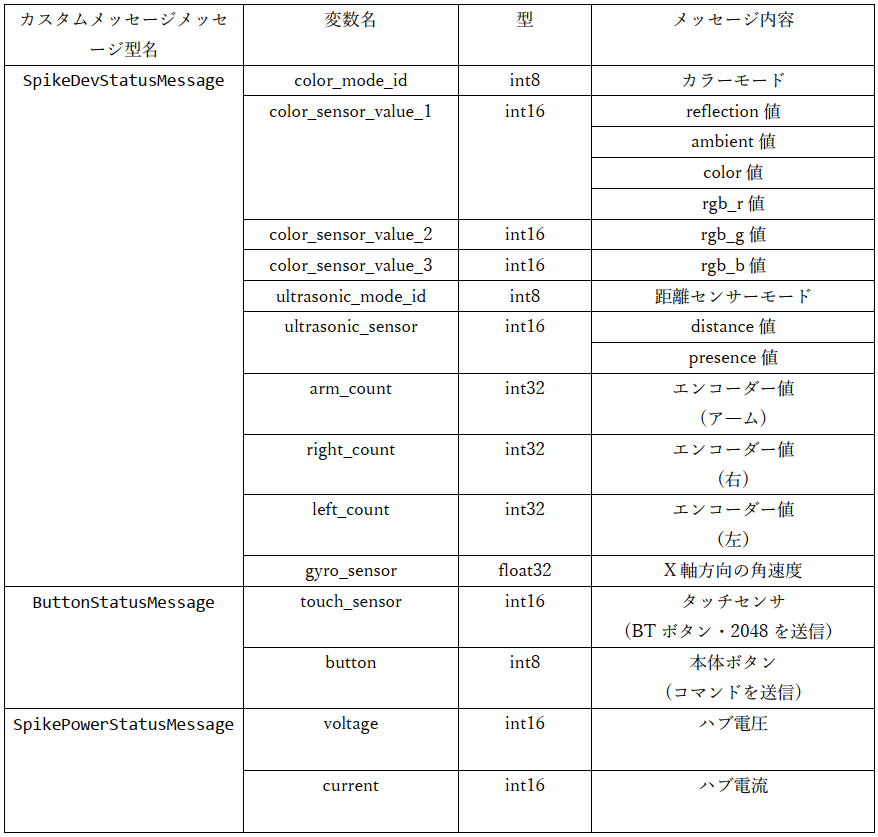
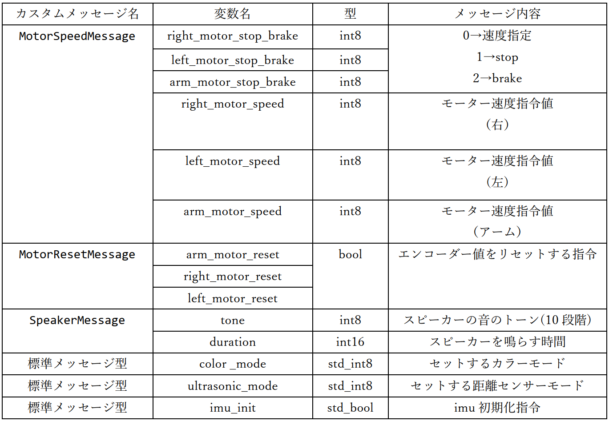

# ROS通信によるETロボコン走行体の制御アプリケーション開発用プラットフォーム（RasPike-ROS）
本ソフトウェアはROS 2によりETロボコン用走行体(もしくはそれと構成が同じロボット)を制御するためのソフトウェアプラットホームである．
<br>
本ソフトウェアを持ちることよりROS 2のプログラムによりETロボコン用走行体を制御することが可能である．

<br>
<br>

# 動作確認済み環境

- SPIKE
   - micro-ROS(uROS)ファームウェア[uros_raspike-rt](./uros_raspike_rt)
        - SPIKE上で動作し，各種センサー値をpublishし，モータ制御値をsubscribeする
        - プリビルドバイナリを用意([asp.dfu](./bin/asp.dfu))
        - [spike-rt](https://github.com/spike-rt/spike-rt)と[micro-ROS_ASP3](https://github.com/exshonda/micro-ROS_ASP3)を使用
            - ファームウェアに変更を加えたい場合に限りインストールが必要

- Raspberry Pi
    - Raspberry Pi OS(64bit，**2023-12-05リリース版**)
    - ROS 2 Humble
- 動作確認済みのバージョン
    - micro-ROS_ASP3
        - コミットID：[3a306729a797d0f4976daab50c5698acffe38a12](https://github.com/exshonda/micro-ROS_ASP3/tree/3a306729a797d0f4976daab50c5698acffe38a12)
    - spike-rt
        - コミットID：[f6724115b0ef8c8367a760eaec2840089e6b4e55](https://github.com/spike-rt/spike-rt/tree/f6724115b0ef8c8367a760eaec2840089e6b4e55)

- SPIKEとRaspberryPiの接続・SPIKEと、センサー、モーターの接続
    - SPIKEとRaspberryPiはシリアルで接続する
        - 接続方法は，後述の**変更点を除いて**RasPike(ETロボコン)環境と同じ．
            - [RasPike GitHub](https://github.com/ETrobocon/RasPike)
            - SPIKEとRaspberryPiの接続方法や，SPIKEとセンサー・モーターの接続は，「[Raspberry PiとSPIKEの接続](https://github.com/ETrobocon/RasPike/wiki/connect_raspi_spike)」を参照
        - RasPikeからの変更点
            - SPIKEとセンサー・モーターの接続ポートを一部変更
                - 超音波センサーの接続ポートとシリアル通信のポートを入れ替えている
                    - 本環境における，SPIKEとデバイスの接続方法

                    |接続デバイス|ポート|
                    |---|---|
                    |アームモータ|A|
                    |右モータ|B|
                    |左モータ|E|
                    |カラーセンサー|C|
                    |serial通信|**F**|
                    |超音波センサー|**D**|
            - **上記の表の構成に沿ったものであれば**筐体はどのような形状であっても構わない
    

# アプリケーション構成
- 2種類の方法でアプリを開発可能である．両者を同時に使用した場合の動作は保証しない
    - ROS 2 APIを直接扱い．ROS2プログラミングによりアプリケーションを開発する方法
        - [ETロボコン走行体向けカスタムメッセージ型](#カスタムメッセージ仕様)を直接扱う
        - ガイドを[ROS2_GUIDE.md](./ROS2_GUIDE.md)に記載
        - サンプルプログラム : [linetrace_sample](./linetrace_sample/)
    - アプリケーション開発用APIを使用
        - 走行体制御アプリケーションの開発向けにカスタムメッセージをラップした専用APIを使用する方法．
        - [専用API仕様](./ros2_raspike_rt/API_REFERENCE.md)
            - 時間コールバック関数である`app_timer()`内にプログラムを記述する．
        - サンプルプログラム : [app_node.py](./ros2_raspike_rt/ros2_raspike_rt/app_node.py)


# ファイル構成
- bin
    - asp.dfu
        - micro-ROS(uROS)ファームウェアのプリビルドバイナリ
        - SPIKEに書き込んで使用する
    - pydfu.py
        - SPIKEへの書き込みプログラム

- raspike_uros_msg
    - ETロボコン走行体用カスタムメッセージのメッセージ型定義用ROS 2パッケージ
    - SPIKEとRaspberry Piの両方で使用
        - SPIKE：`micro-ROS_ASP3\external\primehub\firmware\mcu_ws`に置く
        - Raspberry Pi：`<ROS 2ワークスペース>\src`に置く

- ros2_raspike_rt(アプリ開発用APIを使用する場合に使用するROS 2パッケージ)
    - `ros2_raspike_rt\ros2_raspike_rt\app_node.py`
        - アプリ開発用のファイル
            - **ユーザはこのファイルにアプリを記述する**
            - Pythonによるアプリ開発が可能
            - appNodeクラス内の`app_timer()`に処理を記述する
                - 周期的に呼ばれる
        - APIは[APIリファレンス](./ros2_raspike_rt/API_REFERENCE.md)を参照
    - `ros2_raspike_rt\ros2_raspike_rt\lib`フォルダ内のファイル
        - ROS 2処理に関するのライブラリファイル等    
        - `rpi_ros2_node.py`
            - uROSからのセンサ値の受信・app_node.pyで計算された指令値の送信を行うROS 2プログラム
                - app_node.pyからAPIを介して指令値が渡される
                - uros_raspike-rt(SPIKE)と通信する

- linetrace_sample（ROS 2 APIを直接扱ってアプリを開発した場合のサンプル）
    - **ToDo：修正**
    - uROS(uros_raspike-rt)と通信して動作するROS 2アプリケーションのサンプルパッケージ
        - ROS 2のタスク内に直接ライントレースの処理を記入したもの

- uros_raspike-rt
    - SPIKE側で動作するuROSパッケージのソースコード
    - [bin/asp.dfu](./bin/asp.dfu)のソース

<br>
<br>

# 使用方法(uROSプログラムに変更が必要無い場合)
通常の環境構築の方法
<br>

## Raspberry Pi側の環境構築
### Raspberry Pi OS (**64bit**)をインストール
- [インストラー](https://www.raspberrypi.com/software/)をインストール
- インストラーでRaspberry Pi OS(64bit)のイメージをSDに作成
    - ROSを動かすために**64bit版**を使用する
    - **2023-12-05リリース版**を使用する事を推奨（動作確認済み）
        - [ここ](https://downloads.raspberrypi.com/raspios_armhf/images/?_gl=1*g4pkln*_ga*MTY4NzY2Mzg1NS4xNzA5MDI4NTI3*_ga_22FD70LWDS*MTcwOTEwMTA1MS4yLjEuMTcwOTEwMTUyNS4wLjAuMA..)の2023-05-03-raspios-bullseye-arm64.img.xzなど


### GPIOの接続を有効にする
1. 下記のコマンドで設定ファイルを開く
    ```bash
    sudo nano /boot/config.txt
    ```

1. config.txtの最後に下記を追加
    ```bash
    dtoverlay=uart5
    ```
    
1. リブートする
    ```bash
    sudo reboot
    ```

1. シリアル通信のケーブルをRaspberry Piに接続する
    - 参考：[RasPike](https://github.com/ETrobocon/RasPike/wiki/connect_raspi_spike)

### ROS 2のインストール
1. アップデート
    ```bash
    sudo apt update
    sudo apt -y upgrade 
    ```

1. ROS 2パッケージをインストールする
    ```bash
    wget https://s3.ap-northeast-1.wasabisys.com/download-raw/dpkg/ros2-desktop/debian/bullseye/ros-humble-desktop-0.3.1_arm64.deb
    sudo apt install -y ./ros-humble-desktop-0.3.1_arm64.deb
    source /opt/ros/humble/setup.bash
    ```

1. ビルドツールのインストール
    ```bash
    sudo pip install vcstool colcon-common-extensions
    ```

1. ROS環境の自動読み込み設定
    ```bash
    echo "source /opt/ros/humble/setup.bash" >> ~/.bashrc
    source ~/.bashrc
    ```

1. 動作確認
    ```bash
    ros2 launch demo_nodes_cpp talker_listener.launch.py
    ```
    - 下記のように出力されれば成功
    ```
    [INFO] [launch]: All log files can be found below /home/hiyama/.ros/log/2023-07-04-14-52-42-067659-raspi-1582
    [INFO] [launch]: Default logging verbosity is set to INFO
    [INFO] [talker-1]: process started with pid [1583]
    [INFO] [listener-2]: process started with pid [1585]
    [talker-1] [INFO] [1688449964.564641073] [talker]: Publishing: 'Hello World: 1'
    [listener-2] [INFO] [1688449964.565626925] [listener]: I heard: [Hello World: 1]
    [talker-1] [INFO] [1688449965.564647258] [talker]: Publishing: 'Hello World: 2'
    [listener-2] [INFO] [1688449965.565234628] [listener]: I heard: [Hello World: 2]
    ...
    ```
1. ROS 2用のワークスペースを作成する
    ```bash
    mkdir ros2_ws
    cd ros2_ws
    mkdir src
    ```

1. ROS 2パッケージをワークスペースに置く
    - `ros2_ws\src`に以下のファイルを置く
        - raspike_uros_msg
        - ros2_raspike_rt (ROS2 APIを直接扱って開発を行う場合は不要)
        - linetrace_sample (サンプルプログラムのためどちらでも良い)

1. ROS 2パッケージをビルドする
    ```bash
    colcon build
    . install/setup.bash
    ```
1. **Cパッケージのビルド時にエラーになる場合の解決方法**
    - Cパッケージ(raspike_uros_msg)のビルドでエラーになる事がある
    - その場合は`/opt/ros/humble/opt`にある`libcurl_vendor`フォルダを削除する
        ```bash
        cd /opt/ros/humble/opt
        sudo rm -rf libcurl_vendor
        cd ~/ros2_ws
        colcon build
        ```

### エージェントのビルドと実行（方法1，2のどちらでも可）
#### エージェントのビルドと実行:方法1
1. 参考

- 下記の記事を参考にで`Micro-XRCE-DDS-Agent`をビルドする<BR>
<https://qiita.com/lutecia16v/items/5760551dd3a7a0d3e7d3>

1. `Micro-XRCE-DDS-Agent`のコードをクローン

    ``` bash
    cd ~
    git clone https://github.com/eProsima/Micro-XRCE-DDS-Agent.git
    ```

1. ビルド

    ```bash
    cd Micro-XRCE-DDS-Agent
    mkdir build && cd build
    cmake -DTHIRDPARTY=ON ..
    make
    sudo make install
    sudo ldconfig /usr/local/lib/
    ```
    - **CMakeのバージョンが古いと言われた場合は新しくする**
        - [CMake公式](https://cmake.org/download/)の[Older Releases](https://cmake.org/files/)からcmake-3.27.2-linux-aarch64.tar.gzをダウンロード
        - 下記コマンドで更新([参考サイト](https://qiita.com/koki2022/items/481c1b03445567263a97))
            - ``$ tar -zxvf cmake-3.27.2-linux-aarch64.tar.gz``
            - ``$ cd cmake-3.27.2-linux-aarch64/``
            - ``$ cd cmake-3.27.2-linux-aarch64/``
            - ``$ sudo ln -s /opt/cmake-3.27.2-linux-aarch64/bin/* /usr/bin``
        - .bashrcに以下を追加してロード ($ source ~/.bashrc)
            ```
            export PATH=/opt/cmake-3.27.2-linux-aarch64/bin:$PATH
            export CMAKE_PREFIX_PATH=/opt/cmake-3.27.2-linux-aarch64:$CMAKE_PREFIX_PATH
            ```
        - <補足>
            - ``$ sudo apt remove cmake``等をするとROSが壊れる
            - 壊れた場合は``$ sudo apt install -y ./ros-humble-desktop-0.3.1_arm64.deb``を再度実行

1. 実行

- `verbose_level`を6に設定して、メッセージの受信を表示するようにする
    - 2つ目のエージェントの実行コマンドは`sudo`が必要な場合がある
    - device はSPIKEと接続されているポート名(/dev/ttyXX)を指定
    ```bash
    source /opt/ros/humble/setup.bash
    MicroXRCEAgent serial --dev [device] -v 6
    ```
    - (例)シリアルの接続方法が[RasPike](https://github.com/ETrobocon/RasPike/wiki/connect_raspi_spike)と同じ場合
        ```
        source /opt/ros/humble/setup.bash
        MicroXRCEAgent serial --dev /dev/ttyAMA1 -v 6
        ```
    

#### エージェントのビルドと実行:方法2
1. エージェントのビルド
    ```bash
    cd uros_ws    
    ros2 run micro_ros_setup create_agent_ws.sh
    colcon build
    source install/local_setup.bash
    ```

1. エージェントの実行
    - device はSPIKEと接続されているポート名(/dev/ttyXX)を指定
    ```bash
    ros2 run micro_ros_agent micro_ros_agent serial --dev [device]
    ```    

## SPIKE側の環境構築
1. SPIKEをDFUモードにする
    - SPIKEのbluetooth(BT)ボタンを押したままPC(RaspberryPiでも可)とSPIKEをUSBケーブルで接続する
    - BTボタンが，「ピンク色に点灯」→「虹色に点滅」になるまで押し続ける

1. RaspberryPi等のLinux PCからuros_raspike-rt/bin/asp.dfuを書き込む(Linux上で作業)
    - pyusbをインストール
    ```bash
    sudo pip3 install pyusb
    ```
    - ファームウエアの書き込み
    ```bash
    cd uros_raspike-rt/bin
    sudo python3 ./pydfu.py -u asp.dfu --vid 0x0694 --pid 0x0008
    ```

1. SPIKEとRaspberry Piをシリアルで接続する
    - シリアル通信用のケーブルはSPIKEのポートFに接続する
    - その他の各種センサー・アクチュエーターも[動作環境](#動作環境)で紹介した通りのポートに接続する

## ROS 2プログラムの実行
- Raspberry Piでagentの実行とは別のターミナルを起動してROS 2プログラムを実行する
    - ROS 2プログラム実行のコマンドのフォーマットは次の通り
        ```bash
        ros2 run [パッケージ名] [ノード名]
        ```
### ros2_raspike_rtでアプリを開発・実行する場合（アプリ開発用APIを使用して開発を行う場合）
1. ros2_raspike_rt/ros2_raspike_rt/app_node.pyに処理を記述
    - `app_timer()`はデフォルトでは10ms周期で呼び出される
    - [APIリファレンス](./ros2_raspike_rt/API_REFERENCE.md)
1. 一つ目のRaspberry Piのターミナルでエージェントを実行する
1. SPIKEの電源を入れる
    - 必ず，「エージェントの実行」→「SPIKEの起動」の順番である必要がある
    - Hubのディスプレイに「ET」の文字が表示されたら，エージェントとの接続が完了している
    - ディスプレイに顔が表示される場合はエージェントとの接続が失敗している
1. 二つ目のRaspberry Piのターミナルで下記のコマンドを入力し，アプリを実行する
    ```bash
    cd ~/ros2_ws
    . install/setup.bash
    ros2 run ros2_raspike_rt app_node
    ```
    - ROS 2のプログラムを変更したら，その度に下記のコマンドを実行する必要がある
        ```bash
        cd ~/ros2_ws
        colcon build
        . install/setup.bash
        ```

### ROS 2プログラミングによりアプリケーションを開発する方法
一般的なROS 2のアプリ開発の方法で開発を行う<Br>
1. ROS 2ワークスペースのsrcディレクトリ内にROS 2パッケージを作成する
    ```
    cd ~/ros2_ws/src
    # Pythonパッケージを作成する場合
    ros2 pkg create --build-type ament_python [pkg_name] --dependencies rclpy
    # C++パッケージを作成する場合
    ros2 pkg create --build-type ament_cmake [pkg_name]
    ```
1. ROS 2アプリを開発する
    - ROS2プログラミングのガイド[ROS2_GUIDE.md](./ROS2_GUIDE.md)に従いアプリを開発する
    - (注)Pythonパッケージによる開発のみ動作確認済み
1. 開発したROS 2パッケージをビルドする
     ```bash
    cd ~/ros2_ws
    colcon build
    . install/setup.bash
    ```
1. Raspberry Pi上でuROSエージェントを実行し，SPIKEの電源を入れる
1. アプリを実行する
    ```
    $ cd ~/ros2_ws
    $ ros2 run [pkg_name] [node_name]
    ```


# SPIKE側のuROSプログラムを編集したい場合の環境構築方法（オプション）
- uros_raspike-rtの使用方法
    - uROSプログラム（asp.dfu）を自前でビルドして実行する手順
## Raspberry Pi側の環境構築
- [uROSプログラムに変更が必要無い場合](#使用方法urosプログラムに変更が必要無い場合)と同じ
## SPIKE側の環境構築
1. PC上でワークスペースを作成する
    ```bash
    mkdir ~/asp_uros_ws
    cd ~/asp_uros_ws
    ```

1. spike-rtとmicro-ROS_ASP3をクローン
    - [動作確認済のバージョン](#動作環境)
    ```bash
    git clone https://github.com/exshonda/micro-ROS_ASP3.git
    git clone https://github.com/spike-rt/spike-rt.git
    ```

1. spike-rtとmicro-ROS_ASP3をセットアップ
    - 参考
        - [micro-ROS_ASP3](https://github.com/exshonda/micro-ROS_ASP3)
            - `Makefile.config`のターゲットボードはPrime Hubを選択する
        - [spike-rt](https://github.com/spike-rt/spike-rt)

1. micro-ROS_ASP3にカスタムメッセージ定義パッケージを追加
    - `micro-ROS_ASP3\external\primehub\firmware\mcu_ws`にraspike_uros_msgを置く
    - `micro-ROS_ASP3\micro_ros_asp\micro_ros_asp.mk`に下記を追加
    ```
    INCLUDES += -I$(MIROROS_ASP3_TOP_DIR)/$(MICROROS_INC)/raspike_uros_msg
    ```
    - libmicroros.a のビルドを実行
    ```bash
    cd ~/asp_uros_ws/micro-ROS_ASP3/external
    make build_firmware
    ```

1. uROSパッケージを追加・SPIKEへの書き込み
    - `micro-ROS_ASP3\spike-rt`にuros_raspike-rtを置く
    - 下記のどちらかのコマンドでビルド・書き込み
        - (※)並列ビルドでエラーになる時がある．
            - その時は2回`make asp.bin`でビルドする事ができる
    ```bash
    cd ../spike-rt/uros_raspike_rt
    make asp.bin
    python3 ../../../spike-rt/asp3/target/primehub_gcc/tools/dfu.py -b 0x8008000:asp.bin asp.dfu
    sudo python3 ../../../spike-rt/asp3/target/primehub_gcc/tools/pydfu.py -u asp.dfu --vid 0x0694 --pid 0x0008
    ```
    - または
    ```bash
    cd ../spike-rt/uros_raspike_rt
    make deploy-dfu
    ```
## SPIKEとRaspberry Piの接続・ROS 2アプリの実行
- 接続方法，ROS 2アプリの実行方法の基本的な流れは[uROSプログラムに変更が必要無い場合](#使用方法urosプログラムに変更が必要無い場合)と同じ

# 使用できるパブリッシャー・サブスクライバー
- [linetrace_sample\README.md](./linetrace_sample/README.md/#参考1使用できるメッセージ型・パブリッシャー・サブスクライバー)を参照
    - 注意：QoSを揃える必要がある

# カスタムメッセージ仕様
- SPIKE(uRPS) → Raspberry Pi(ROS 2)<BR>


- Raspberry Pi(ROS 2) → SPIKE(uROS) <BR>


# 設計メモ
- uROS(SPIKE)側のQoSについて
    - uROS側で10ms周期で送信するトピックのQoSをRELIABLEにすると，uROS側のサブスクライバーがデータをドロップすることを確認．
        - uROSはシングルタスクで動いている．
        - uROSのパブリッシャー(RELIABLE)はトピックをパブリッシュするとack待ちを行う．
        - ack待ちの間は，uROSのサブスクライバーは実行を待たされる．
        - 待たされている間に次のデータが来ると，前のデータをドロップする．
    - そのため，周期送信を行うトピックのQoSはBEST-EFFORT(ackを返さない)を使用した．
        - 以下のメッセージはBEST-EFFORTで通信する．
            - モーターの速度指令（MotorSpeedMessage）
            - カラーセンサーのモード指令
            - PUPデバイスのステータス（SpikeDevStatusMessage）
            - HUBボタンのステータス（ButtonStatusMessage）
            - HUBの電源情報（SpikePowerStatusMessage）
- メッセージのグループ化について
    - ROSの通信ではトピック一つにつき，比較的大きいサイズの情報が付随する．
    - 全メッセージを個別のトピックに分けるとオーバーヘッドが大きすぎるため，いくつかのメッセージを一つのトピックにグループ化した．
    - グループ化の方法にはArray型とカスタムメッセージ型がある．
        - 今回はカスタムメッセージ型を用いる方法を採用した．
            - カスタムメッセージ型はArray型に比べてオーバーヘッドが小さいため．

- カラーコードについて
    - カラーコードはオリジナルのものを用意した．
    - カラーコードは[APIリファレンス](./ros2_raspike_rt/API_REFERENCE.md)を参照．
    - EV3-RTのAPIに揃えたい場合はuros.cの`raspike_rt_detectable_color`を`detectable_color_for_EV3`に変更する．
- ボタンコマンドについて
    - SPIKE(uros.c)は，押されているボタンに応じたコマンドを送信している.
    - コマンドの値はRasPike環境に揃えている．
    
